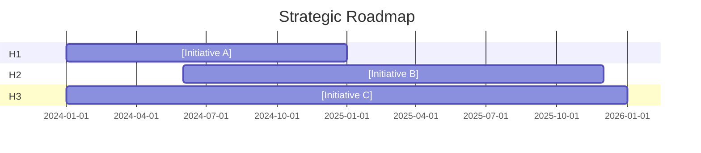

# Horizon Planning Skill

## Purpose

Balance the tension between optimizing today's business, building tomorrow's growth engines, and creating future options. Prevent common failure modes: over-investing in the core until disruption hits, or betting everything on unproven futures while the core collapses.

## The Three Horizons Framework

### Horizon 1 (H1): Extend & Defend the Core
**Timeframe**: Now – 12 months
**Focus**: Mature businesses that provide current cash flow and profits

**Characteristics**:
- Proven business model
- Existing customers and channels
- Optimize operations, reduce costs, improve efficiency
- Incremental improvements, not major changes
- Fund the other horizons

**Success metrics**: Revenue, margin, customer retention, operational efficiency

**Questions to classify as H1**:
- Does this improve our current core business?
- Does this protect existing revenue/customers?
- Is the business model proven and customers known?
- Will this generate returns within 12 months?

---

### Horizon 2 (H2): Build Emerging Businesses
**Timeframe**: 12 – 36 months
**Focus**: Emerging opportunities requiring investment to scale

**Characteristics**:
- Business model validated but not yet at scale
- Known customer need, building product-market fit
- Adjacent to core (new products, new markets, or new models)
- Requires dedicated resources and management attention
- Bridge between today and transformational future

**Success metrics**: Revenue growth rate, market share gains, product-market fit indicators

**Questions to classify as H2**:
- Is there validated customer demand?
- Do we have a testable business model hypothesis?
- Can this scale within 2-3 years?
- Is this adjacent to existing capabilities or markets?

---

### Horizon 3 (H3): Create Future Options
**Timeframe**: 36+ months
**Focus**: Seeds for future growth, often uncertain but high potential

**Characteristics**:
- Experimental, high uncertainty
- May disrupt existing business (including our own)
- Research projects, pilots, venture investments
- Small bets, options-based thinking
- Not dependent on near-term results

**Success metrics**: Learning velocity, option value, strategic positioning

**Questions to classify as H3**:
- Is this highly uncertain but potentially transformational?
- Are we exploring/learning rather than scaling?
- Could this be a future H2 or H1?
- Can we afford to be wrong?

---

## Initiative Classification Process

### Step 1: List All Strategic Initiatives
Inventory all proposed and in-flight initiatives:
- Product development efforts
- Market expansion plans
- Operational improvements
- Technology investments
- Partnership/M&A opportunities
- Organizational changes

### Step 2: Classify Each Initiative

For each initiative, answer:

| Question | H1 Answer | H2 Answer | H3 Answer |
|----------|-----------|-----------|-----------|
| Business model status | Proven | Validated, not scaled | Hypothesis |
| Customer clarity | Known customers | Known need, finding customers | Exploring |
| Time to meaningful results | <12 months | 12-36 months | 36+ months |
| Risk profile | Low, operational | Medium, execution | High, strategic |
| Funding approach | P&L funded | Separate budget, milestones | Small bets, learning |

### Step 3: Validate Classification

Test each classification:
- **H1 that feels like H2**: Are you avoiding hard optimization decisions?
- **H2 that feels like H1**: Are you being too conservative with emerging bets?
- **H3 that feels like H2**: Are you over-committing to unvalidated ideas?

---

## Resource Allocation Framework

### Typical Allocation Guidelines

| Company Stage | H1 | H2 | H3 | Rationale |
|---------------|----|----|----|-----------|
| Startup | 50% | 40% | 10% | Finding product-market fit |
| Growth | 60% | 30% | 10% | Scaling proven model |
| Mature/Stable | 70% | 20% | 10% | Protecting core while exploring |
| Disrupted | 40% | 40% | 20% | Urgent need for transformation |

**Adjust based on**:
- Industry rate of change
- Competitive pressure
- Cash position
- Risk tolerance

### Resource Types to Allocate
- **Financial**: Budget dollars, capital investment
- **People**: Headcount, leadership attention, best talent
- **Time**: Management calendar, organizational focus

---

## Sequencing & Dependencies

### Dependency Types

1. **Prerequisite**: Must complete A before starting B
2. **Enables**: A makes B more likely to succeed
3. **Funds**: A generates resources for B
4. **Competes**: A and B compete for same resources

### Sequencing Principles

1. **H1 funds H2 and H3**: Core business health enables bets
2. **H3 graduates to H2**: Successful experiments become emerging businesses
3. **H2 graduates to H1**: Scaled businesses become new core
4. **Cannibalization planning**: When will H2/H3 disrupt H1?

### Dependency Mapping

```
[H1 Initiative A] ----enables----> [H2 Initiative B]
       |                                    |
     funds                              graduates to
       |                                    |
       v                                    v
[H3 Experiment C]              [Future H1 Business D]
```

---

## Governance by Horizon

### H1 Governance
- Quarterly business reviews
- Standard operating metrics
- P&L accountability
- Efficiency and optimization focus

### H2 Governance
- Monthly milestone reviews
- Growth-focused metrics
- Separate budget with stage gates
- Balance between growth and path to profitability

### H3 Governance
- Discovery/learning reviews (not ROI reviews)
- Hypothesis testing metrics
- Small, contained budgets
- Kill criteria defined upfront

---

## Output Template

```markdown
## Three Horizons Roadmap

### Initiative Portfolio

#### Horizon 1: Extend & Defend Core (Now – 12 months)
| Initiative | Owner | Investment | Key Metric | Target |
|------------|-------|------------|------------|--------|
| [Name] | [Who] | [$X] | [Metric] | [Value] |

#### Horizon 2: Build Emerging Businesses (12 – 36 months)
| Initiative | Owner | Investment | Stage Gate | Graduation Criteria |
|------------|-------|------------|------------|---------------------|
| [Name] | [Who] | [$X] | [Current stage] | [What success looks like] |

#### Horizon 3: Create Future Options (36+ months)
| Initiative | Owner | Investment | Hypothesis | Kill Criteria |
|------------|-------|------------|------------|---------------|
| [Name] | [Who] | [$X] | [What we're testing] | [When to stop] |

### Resource Allocation
| Resource Type | H1 | H2 | H3 | Rationale |
|---------------|----|----|----|-----------|
| Budget | [%] | [%] | [%] | [Why] |
| Headcount | [%] | [%] | [%] | [Why] |
| Exec attention | [%] | [%] | [%] | [Why] |

### Dependencies & Sequencing


### Key Dependencies
1. [Initiative A] enables [Initiative B] because...
2. [Initiative B] must validate before investing in [Initiative C]...

### Governance Rhythm
- **H1**: [Frequency and format of reviews]
- **H2**: [Frequency and format of reviews]
- **H3**: [Frequency and format of reviews]

### Migration Plan
| Initiative | Current Horizon | Target Horizon | Timeline | Trigger |
|------------|-----------------|----------------|----------|---------|
| [Name] | H3 | H2 | [When] | [What must be true] |
| [Name] | H2 | H1 | [When] | [What must be true] |
```

---

## Common Pitfalls

❌ **All H1**: No investment in future growth; vulnerable to disruption
❌ **Overweight H3**: "Innovation theater" without business impact
❌ **No H2**: Gap between core and experiments; nothing scales
❌ **Wrong governance**: Applying H1 ROI metrics to H3 experiments
❌ **Unclear graduation**: No criteria for when initiatives move between horizons
❌ **Best people on H1**: Emerging businesses need best talent, not just budget

---

## Output File Requirements

When this skill completes, write TWO files:

### 1. Notes File (`04-horizon-planning/notes.md`)
Contains:
- Input context received
- Key decisions made during analysis
- Assumptions and confidence levels
- Questions for user validation
- References to sources used

### 2. Output File (`04-horizon-planning/output.md`)
Contains:
- Core deliverable using the Output Template above
- Structured for downstream skill consumption
- Cross-references to notes file for audit trail

### 3. Update Manifest
After writing files, update `00-manifest.md` with:
- Status: Complete
- Output path: `04-horizon-planning/output.md`
- Notes path: `04-horizon-planning/notes.md`
- Timestamp
